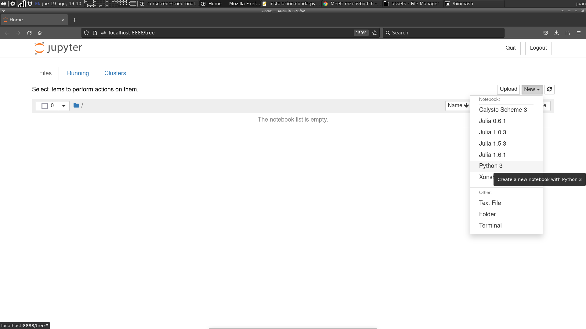
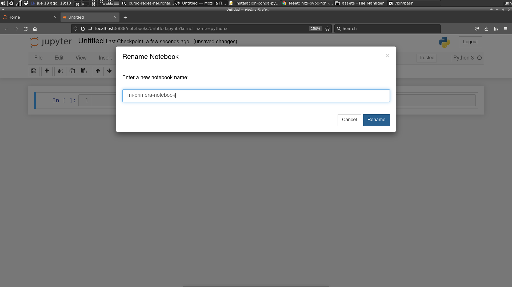

# Instalación de **conda**, **Python** y **Jupyter** en **Ubuntu Linux**.

## Instalación de **miniconda**

El tutorial lo realizaremos desde la **máquina virtual** recientemente creada:

1. Abra el navegador y descarge de [https://docs.conda.io/en/latest/miniconda.html](https://docs.conda.io/en/latest/miniconda.html) el instalador de **miniconda**. En nuestro caso, que utilizamos **Ubuntu 64bits** como sistema operativo, el instalador es [Miniconda3 Linux 64-bit](https://repo.anaconda.com/miniconda/Miniconda3-latest-Linux-x86_64.sh).
  
2. Utilizando una terminal, abra el directorio donde descargó el archivo instalador y ejecútelo (no es necesario ni recomendado utilizar credenciales de root)
  
  `$ bash Miniconda3-latest-Linux-x86_64.sh`
  
y continúe con la instalación por defecto.
  
## Creación de un environment **Python** equipado con **Jupyter**
  
1. Active el **entorno** o **environment** base de conda
  
  `$ source ~/miniconda3/bin/activate`
  
2. Cree un nuevo **environment** con **Python 3**.
  
  `(base) $ conda create -n redes-neuronales python=3`
  
3. Activamos el nuevo **environment**
  
  `(base) $ conda activate redes-neuronales`  
  
4. Instalamos los paquetes **Jupyer**, **matplotlib**, **numpy**, **scipy** y **scikit-learn**.

  `(redes-neuronales) $ conda install -c anaconda numpy`
  
  `(redes-neuronales) $ conda install -c conda-forge matplotlib`
  
  `(redes-neuronales) $ conda install -c anaconda jupyter`
  
  `(redes-neuronales) $ conda install -c anaconda scipy`
  
  `(redes-neuronales) $ conda install -c anaconda scikit-learn`
  
## Inicie **Jupyter**

1. Active el entorno base de conda (salvo que ya lo tenga activo)

  `$ source ~/miniconda3/bin/activate`

2. Active el entorno recientemente creado en conda

  `(base) $ conda activate redes-neuronales`
  
3. Luego type
  
  `(redes-neuronales) $ jupyter notebook`
  
esto abrirá una ventana en su navegador con el administrador de **notebooks** de 
**Jupyter**.

4. Luego, cree una nueva notebook

    
    
5. Y finalmente, clickeando donde dice **Untitled**, cambiele el nombre

    

