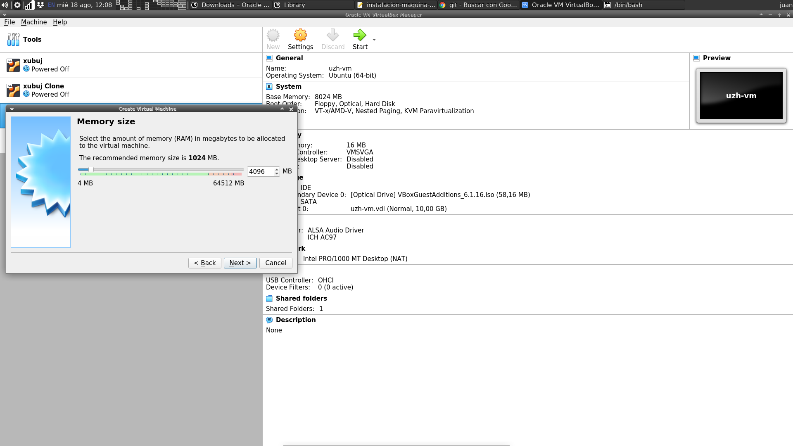
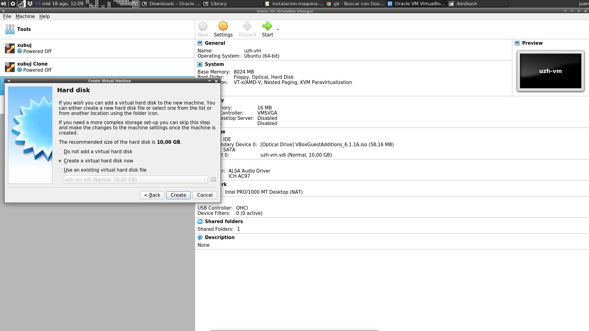
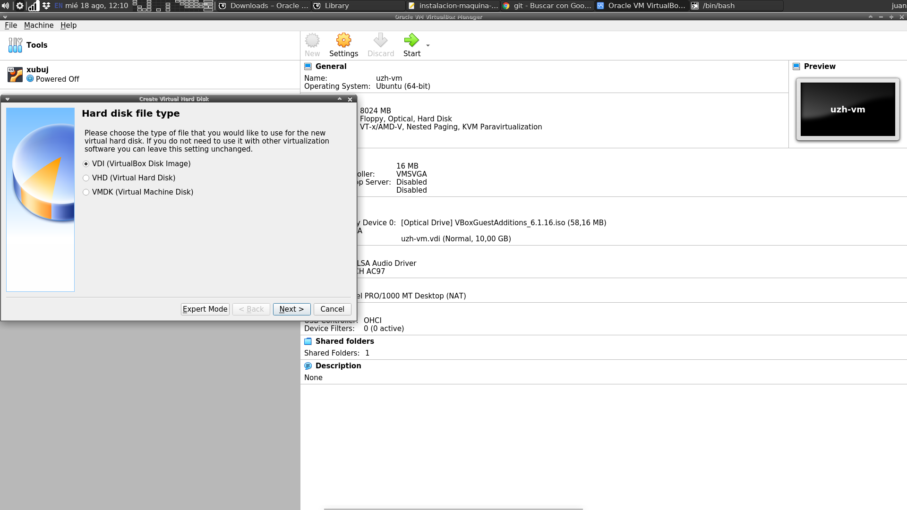
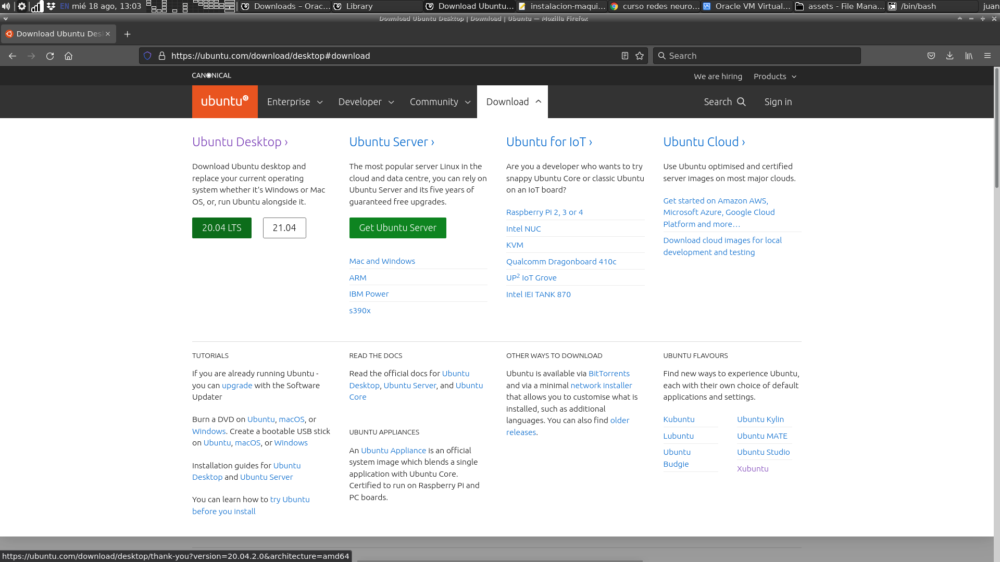
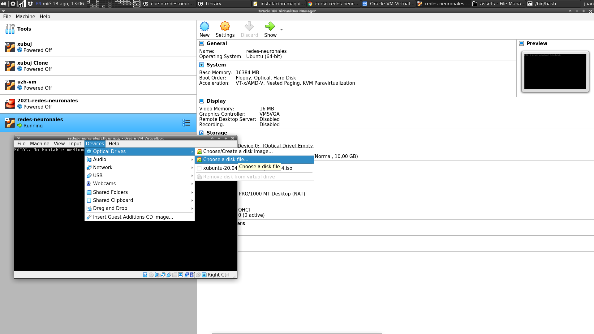
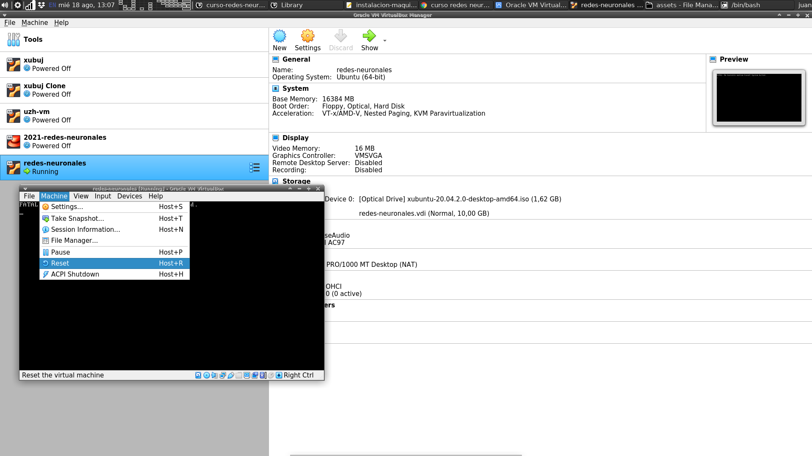

# Instalación de Máquina Virtual **Virtual Box**

Aquellos usuarios de **Windows** que deseen experimentar con **Linux**, podrán hacerlo utilizando una **máquina virtual** de **Virtual Box**.

**Virtual Box** es un administrador de máquinas virtuales que Ud. puede instalar en su **Sistema Operativo**, al cuál llamaremos **host** o **anfitrión**. Luego, con este administrador **Virtual Box**, ud. puede crear máquinas viruales e instalar en ellas los **Sistema Operativo** (SO) que desee. LLamaremos a cada uno de ellos, un **Sistema Operativo** **guest** o **invitado**. Luego podrá instalar en estos sistemas operativos **guest** los programas que desee. 

Para ello, aquí presentamos un tutorial para:

  1. instalar **Virtual Box**,
  2. crear una **maquina virtual** con **Virtual Box**, e
  3. instalar **Ubuntu** en la **maquina virtual**.
  
## Instalar **Virtual Box**

La receta es:

  1. Ir a [https://www.virtualbox.org/](https://www.virtualbox.org/)
  2. Descargar de [https://www.virtualbox.org/wiki/Downloads](https://www.virtualbox.org/wiki/Downloads) el instalador que corresponda a su sistema. Por ejemplo, si Ud. tiene **Windows**, el instalador para el mismo es [Windows hosts](https://download.virtualbox.org/virtualbox/6.1.26/VirtualBox-6.1.26-145957-Win.exe)

## Crear una **maquina virtual** con **Virtual Box**

  1. Inicial **Virtual Box**.
  2. Darle click al boton **New** (arriba centro).
  3. Aparece una ventana en donde hay que darle un nombre a la **máquina virtual** y elegir el tipo (ej. **Linux**) y la versión de **Sistema Operativo** **guest** (ej. **Ubuntu 64bit**),
      
  4. Luego darle a **Next**, aparece una nueva ventana en donde hay que elegir cuanta **memoria virtual** vamos a asignar a la **máquina virtual**. Les recomiendo 4GB o más. Recuerde no confundir MB (Mega Bytes) con GB (Giga Bytes), 1GB = 1000MB.
          
  5. Luego hay que crear un **disco virtual**. Simplemente clickee **Next**.
            
  6. Luego hay que especificar el tipo de disco virtual a utilizar. El recomendado está bien. Simplemente clickee **Next**.
      
  7. Luego hay que especificar si el **disco virtual** (el cuál será un gran archivo en su **Sistema Operativo** **host**) tendrá un tamaño dinámico o fijo. La opción dinámica es conveniente. Simplemente clickee **Next**.
        
  8. Luego hay que especificar el tamaño máximo del **disco virtual**. Sugiero 20GB.
      
     Luego, clickee **Crear** y la **máquina virtual** se creará.

## Instalar **Ubuntu** en la **maquina virtual**

  1. Bajar el archivo **.iso** (imagen del CD) de instalación de **Ubuntu**. Sugiero bajar la última versión **LTS** de **64bits**, actualmente la [20.04 LTS](https://ubuntu.com/download/desktop/thank-you?version=20.04.2.0&architecture=amd64).
      
  2. Inciar la **maquina virtual** recién creada eligiendola del menú y clickeando el boton **Start**. Esto inicializará la máquina, pero la misma dará error ya que no hemos insertado el archivo **.iso** o CD de instalación previamente descargado. Para insertarlo, ir al menú de la **máquina virtual**: *Devices -> Optical Drives -> Choose a disk file*, y elegir el archivo **.iso** previamente descargado. 
      
  3. Luego hay que resetear la **máquina virtual** llendo al menu: *Machine -> Reset*.
        
  4. La **máquina virtual** debería reiniciar ejecutando el proceso de instalación de **Ubuntu**.
        
     Proceder con la instalación. En algun momento puede que durante el proceso le aparezca un cartel preguntando si desea borrar el disco rígido. No se asuste, el disco que se borrará será el de la **máquina virtual** recientemente creada, y no el de su sistema operativo **host**. Si dicho cartel aparece, proceda.
