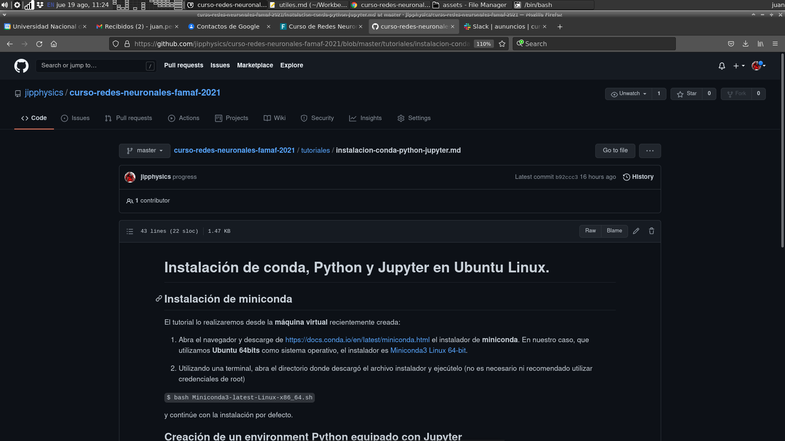
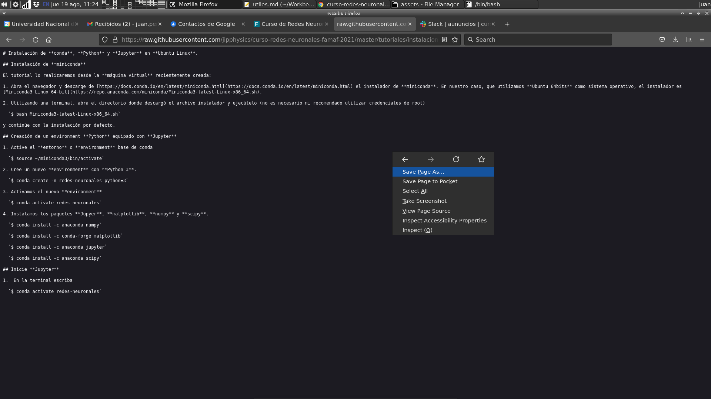
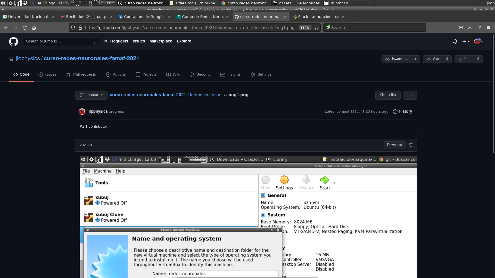

# Linux

  1. [Cheatsheet de comandos de Linux, en español](https://cheatography.com/jonathan992/cheat-sheets/gnu-linux-command-spanish/)

# GitHub  

1. Si desea bajar todo el repositorio, vaya a la página principal del mismo, clickee el botón **Code** y econtrará un botón **Download ZIP**. Clickeelo y se bajará un archivo **.zip** con todo el contenido del repositorio.
  
   
  
2. Si desea bajar un archivo particular del repositorio. Navegue hasta el archivo deseado. 
  
    2.1 Si el archivo es de texto o similar, encontrará un botón que dice **Raw**. Clickeelo y el navegador web le mostrará el contenido textual del archivo, que ud. podrá bajarlo clickeando el boton derecho de su mouse, o utilizando la opción (**Guardar** o **Save**) correspondiente que ofrece el menú de su navegador. 
    
    

    
    
    2.2 Si el archivo no es de texto (ej. una imagen), entonces en vez de **Raw** existirá la opción **Download**. Clickeela para bajar el archivo.
    
    
